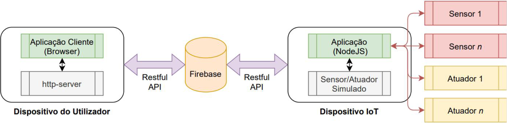

# DAM - Project 2024/2025

    

> **Warning**: This repository contains sensitive files within its commit history which must never be shared publicly. A copy without such files in its history could be used for such purpose instead.

## Intelligent Control and Monitoring of an Agricultural Greenhouse

### Requirements:
- [x] display 2 or more general environmental information;
    - [X] Temperature/Humidity
- [X] display 2 or more distinct zones (sections), each with 2 or more elements;
    - [X] E.g. Vegetable zone, fruit zone, legume zone;
    - [X] Dynamic addition/removal of zones through the 3rd page.
- [X] use 2 or more types of sensors;
    - [X] Temperature/Humidity;
    - [X] LDR.
- [X] use 2 or more types of actuators;
    - [X] LEDs;
    - [X] Motor (Absolute value input).
- [X] allow defining 1 or more types of rules, using at least 1 sensor and/or actuator;
    - [X] Automated actions based on sensor readings.
- [X] use 2 or more external APIs;
    - [X] Weather;
    - [X] Map.
- [x] display data in real-time;
- [X] use Firebase database;
- [X] allow (dis)associating sensors to sections and allow creating/deleting sections.
      
Extras:
- [X] E.g. Local storage for dark/light theme of the website.

### General pipeline:

    

### Adopted file structure in Firebase:
 - rules
    - *hum03*
        - trigger (sensor(s) that trigger an action)
            - *water03*
        - condition
            - **if-higher-than** 
        - conditionValue
            - 30 
        - target
            - *motor01*
        - targetValue
            - *True*
    - *led01* 
        - trigger (sensor(s) that trigger an action)
            - *water03*
        - condition
            - **if-is-activate**
        - conditionValue
            - *motor01*
        - target
            - *motor01*
        - targetValue
            - *False*
 - layout
    - default
        - *hum03*
        - *water03*
        - *lights01*
    - fruits
        - *temp01*
        - *temp02*
        - *hum01*
        - *water02*
    - veggies
        - *hum02*
        - *temp03*
        - *water01*
- messages
    - 'name': *temp01*, 
        - type: sensor
        - content: *23.21*, 
        - datetime: *info*
    - 'name': *temp02*, 
        - type: **sensor**, (this identifies a sensor) 
        - content: *6.21*,  (this is published by the microcontroller/node)
        - datetime: *info*
    - 'name': *motor1*, 
        - type: **actuator**, (this identifies the actuator) 
        - content: power-on,  (this is read by the microcontrollers/nodes)
        - datetime: *info*
    - 'name': *led01*, 
        - type: actuator,
        - content: power-off,
        - datetime: *info*

(other options: **if-lower-than**, **if-eual-to**)
    
| Sensors |
|----------|
| **if-higher-than** |
| **if-lower-than** |
| **if-equal-to** |

| Actions |
|----------|
| **power-on** |
| **power-off** |

**layout**: contains the configuration for the "zones":
 - The IoT device never sends or receives data for this field
 - The user device (web client) reads this configuration to generate the first page
 - When receiving a sensor with an unknown name (not associated with an existing zone), it is added to the **default** zone by default
 - The third page allows (dis)associating names to zones, being the only component developed for editing this space
 - The **layout** only contains the arrangement of the zones, the sensor values are always received in **messages**
 
**messages**: contains the received messages:
- each message contains the fields **name**, **content**, **type**
    - name: sensor or actuator identifying name
        - datetime: timestamp of when datetime when the information was sent
        - content: sensor reading or actuator state
        - type: sensor or actuator
    
**rules**: contains the configuration for actions:
- the (dis)association of rules is dynamic and only editable through the second page

